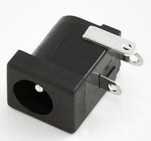
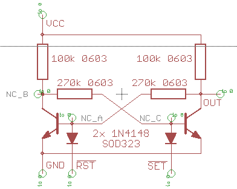

# Libraries created with Eagle 7.7.0 Ultimate

## ReusedBarrelConnector.lbr  
  
Because I wanted to reuse a barrel connector from a scrapped laptop with the power supply still working.  
  
## TestFlipflopModule.lbr  
  
A test to see if we can make modules with Eagle. This is a simple flipflop with two transistors as a single component.  
